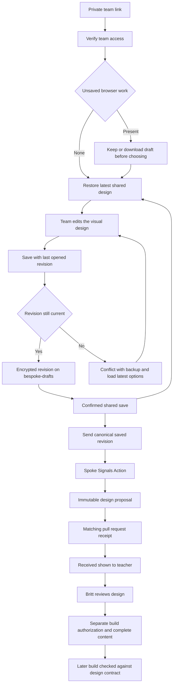

# BeSpoke shared design service setup

This is the administrator guide. Teachers use a private team link, choose a look,
and save it. They do not create accounts, choose passwords, edit files, or run
commands. Their [meeting guide](../../bespoke/team-guide.html) explains those steps.

The wizard remains on GitHub Pages. Its Save, Open, history, and Send controls call
a Netlify function. The function stores encrypted design revisions on the
`bespoke-drafts` Git branch and starts the existing Spoke Signals workflow when a
team requests review. Neither saving nor sending builds lessons, applies a design
to lesson HTML, merges a proposal, or publishes content.

## Process map

This is the target flow implemented by the service and wizard. It still requires
the hosted acceptance checks below before it can be called live.



Team access protects opening and changing the shared draft. The repository is
public, so the proposal created by **Send to Britt** can be read publicly. Use work
contact details and non-sensitive sample text. A private team link does not make
the review proposal private; never include credentials in selection content.

## Provision private team access

Access is assigned by Britt or an administrator before teams begin. Each of the
six planned lessons gets its own random access code and private link. There is no
public first-come claim of a lesson and no teacher-chosen four-character code.
Anyone with a private link can use that team's design, so share it only in the
intended team's private channel or other approved private location.

The administrator provisioning command is:

```sh
node scripts/bespoke-provision.mjs \
  --output "/absolute/path/to/private-bespoke-setup" \
  --wizard-url "https://YOUR-PAGES-HOST/YOUR-PROJECT/bespoke/"
```

Use an output directory outside this repository and outside any public website.
The command creates `server-env.json`, `team-access.json`, and `team-links.html`
with owner-only file permissions in an owner-only directory. It refuses an existing
output directory or a directory inside the repository. It does not create a PAT
or rotate an existing service's keys. Store the resulting material in approved
private storage. Do not paste access codes, private links, encryption keys, or tokens into an issue,
pull request, repository file, public channel, or diagnostic log.

A team link ends with `#team=<lesson-id>.<random-access-code>`. The browser removes
that credential from the address bar when it reads the link and remembers the
team session locally when browser storage permits. The fragment is not part of
the initial page request. The credential is still used to authenticate service
requests; it is a real access secret, not a visual-preview lock. Treat remembered
access on shared computers with the same care as the original link.

Pin the correct private link in each team's Teams channel. A teacher returning on
another computer uses that original link. Ask teams to keep one person operating
BeSpoke during each meeting.

## Configure the service

Create a fine-grained GitHub personal access token limited to
`doclegg05/Curriculum-Employability-Skills` with:

- **Contents: Read and write**, for encrypted design revisions on `bespoke-drafts`.
- **Actions: Read and write**, to dispatch and observe the Spoke Signals workflow.
- **Pull requests: Read**, to confirm the matching proposal receipt. Creation of
  the proposal uses the workflow token, not this PAT.

The workflow's own GitHub token creates the proposal pull request. Teachers never
receive the administrator token. Keep the PAT restricted to this repository; it
is not a teacher credential and is not the encryption key.

Set these Netlify environment variables in the **production** deploy context.
Use Functions scope and mark values secret when the plan supports those features.
The current Personal plan uses standard protected project environment variables
with all scopes; values are readable to authorized account administrators, not
write-only Secrets Controller values. No plan upgrade is required. Never copy
values into the public site, build output, or `netlify.toml`. This service has no
build step that embeds environment values. Verify the variable names and runtime
behavior after setting them; the connector can incorrectly report success for a
setting the plan rejects.

Required variables:

| Variable | Value and purpose |
|---|---|
| `BESPOKE_GITHUB_TOKEN` | The restricted PAT described above |
| `BESPOKE_DRAFT_KEY` | A stable, independently generated 32-byte encryption key encoded as base64 |
| `BESPOKE_TEAM_KEYS` | A JSON object mapping each allowed lesson ID to the SHA-256 base64url digest of its provisioned access code |

The provisioner supplies the encryption key and team-key map in `server-env.json`.
The teacher links are in `team-links.html`; `team-access.json` is private
administrator recovery material. Only access-code hashes go into `BESPOKE_TEAM_KEYS`; keep the original private links outside the
service configuration. Keep a secure backup of `BESPOKE_DRAFT_KEY`: losing it
makes the stored designs unreadable.

Stage the small service package before deploying:

```sh
node scripts/bespoke-stage-service.mjs "/absolute/path/to/new-service-stage"
```

Choose a new staging directory outside this repository. Run the authorized
Netlify CLI or connector deployment from that staging directory, not from the
full curriculum checkout. The stage contains only `netlify.toml`, the function
and its shared module, the landing note, three schema/catalog authority files,
and a minimal Node package manifest. It excludes lesson media, private setup
files, and credentials. The repository remains the source of truth; create a
fresh stage after code or catalog changes, and do not edit the staged copy.
Publish `netlify/site`, use functions in `netlify/functions`, and leave the build
command empty. Netlify hosts the service and a short landing note, not a second
curriculum site.

Set the public `apiBase` in `bespoke/handoff-config.json` to
`https://YOUR-SERVICE.netlify.app/api/bespoke`, then publish the wizard/configuration
on the Pages branch. The endpoint URL is public; never place any secret in that
file. The workflow and function must be deployed from compatible reviewed code.

Until both the endpoint and service configuration are deployed, the browser must
show that shared saving is unavailable. A local browser copy or a downloaded
backup is not evidence of a successful shared save.

## What saving and sending mean

**Save shared design** writes an encrypted revision. The browser supplies the
revision it last opened, so a newer save from another computer produces a conflict
instead of silently being overwritten. A failed or uncertain save must remain
visible to the teacher, with a downloadable backup available. Browser storage is
a convenience copy and may be cleared or unavailable.

**Open team design** loads the latest shared revision after access is verified.
Opening a private team link can restore the shared design automatically when the
browser has no unsaved changes. Unsaved browser work must be preserved until the
teacher chooses which version to keep. History offers older saved looks; saving
an older look creates a new revision rather than deleting newer history.

**Send to Britt** submits the saved design through Spoke Signals. Starting the
workflow is only processing, not delivery. The UI may show **Britt received the review request.** only after
the service confirms the matching proposal pull request. Failure, timeout, and
pending processing must be distinguished. Retrying the same design must find or
reuse its existing proposal rather than create duplicates. Design review is
separate from permission to build a lesson.

Do not merge `bespoke-drafts` into `main`. It contains encrypted team records, not
publishable curriculum. Its commits provide saved-version history; the interface lists the newest ten
saves. Do not prune
or rewrite that branch without an agreed retention and recovery plan.

The function is configured to limit requests to 120 per IP address per minute.
Several teams may share a school network address. Include concurrent team use in
the hosted check and confirm a limit response is shown as retryable, never as a
successful save or receipt.

## Rotation and recovery

- **PAT rotation:** replace `BESPOKE_GITHUB_TOKEN` while retaining the draft key and
  team-key map. The stored designs remain decryptable because encryption does not
  depend on the token. Verify Open and Save after the replacement.
- **Team access reset:** only an administrator issues a new random access code,
  updates that lesson's hash, and privately replaces its pinned team link. Keep
  the same lesson ID and draft encryption key so its saved data remains available.
  Old links and remembered sessions should fail authentication after the reset.
- **Draft-key rotation:** requires a deliberate data migration. Do not simply
  replace the key or rerun setup with a new key over an existing service. Preserve
  the previous key securely until all retained revisions are migrated and tested.
- **Browser loss:** reopen the original team link to recover the latest confirmed
  shared revision. Use a downloaded backup for work that never reached the service.
- **Submission failure:** check the matching Spoke Signals workflow and proposal
  receipt. Do not tell a team its design was received merely because dispatch
  returned successfully.

## Deployment acceptance

Local tests do not prove the hosted service works. Before inviting teams, use a
synthetic design to verify all of the following against the deployed Pages and
Netlify versions:

| Check | Expected result | Failure and recovery |
|---|---|---|
| Open a provisioned link, then try an invalid or revoked code | The assigned lesson opens; the other request is rejected before its data is read | Administrator replaces the private team link; no public claiming or teacher-created code |
| Save on one computer, close it, open on another | The same confirmed revision and choices appear | Preserve the browser draft or backup; check endpoint/configuration and retry |
| Open with unsaved browser work | Explicit choice preserves the local draft until the teacher decides | Download the unsaved draft before loading a different shared version |
| Save concurrently from two computers | The older revision produces a conflict and cannot overwrite the newer save | Download backup, load the latest design, discuss/reapply agreed differences, save anew |
| Review an older saved look and restore it | An explicit restore onto the current shared revision creates a new save; later history remains | A stale revision is still rejected; refresh latest before applying recovered choices |
| Interrupt the network while saving | Pending, failed, and successful saves are distinguished; backup remains usable | Keep the page open, download a backup, reconnect, and verify the latest shared save |
| Send the current saved design | Processing persists until a matching draft proposal pull request is confirmed | Surface failure or pending status; retry the same request without unrelated duplicates |
| Change local choices without saving, then send | The service does not silently submit a different saved or unsaved design | Save deliberately and send the matching current shared revision |
| Use several teams behind one network address | Normal concurrent use completes; a rate-limit response remains a visible retryable failure | Preserve drafts and backups, wait before retrying, and review service limits if ordinary meetings are affected |
| Rotate the PAT while keeping the draft key | Existing revisions still decrypt and Save/Open work | Restore valid repository permissions; never regenerate the draft key to fix token access |
| Leave a shared-browser session | After save/backup confirmation, remembered access and local recovery data are removed; shared record remains | Close all team tabs and remove private downloaded material after securing needed work |

Record the deployed commit, dates, devices/browsers, revision IDs, and a synthetic
proposal receipt. Redact access links and secrets. The process is not accepted
until the tests exercise the real Pages host, Netlify service, and GitHub workflow.

The Netlify integration has been reconnected. Full hosted acceptance of the
deployed Save/Open/Send flow has not yet been recorded. Update the release
evidence with the deployed commit and test results before describing shared
saving as live or ready for teams.
