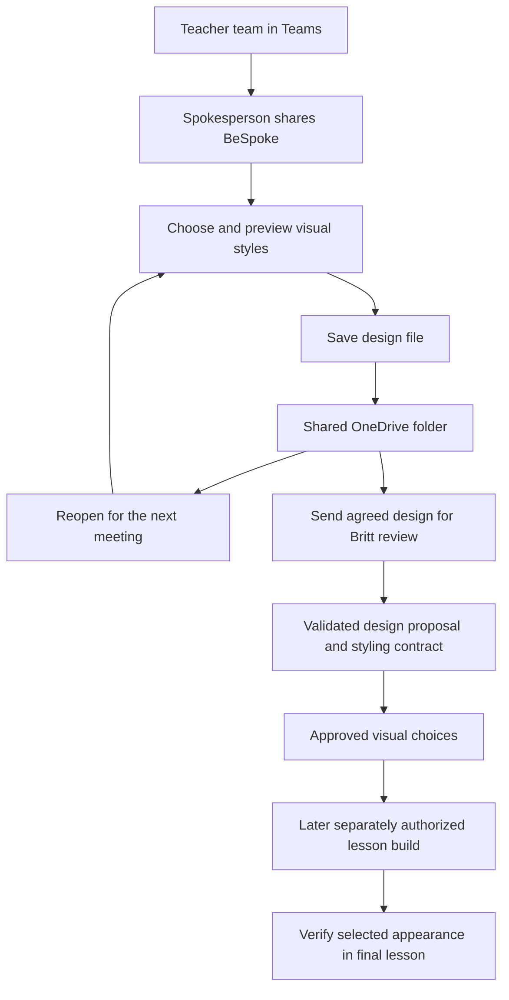

# SPOKES project review and BeSpoke readiness

Review date: September 22, 2026. Baseline: `d80a3f7` on `main`, refreshed before review.
Scope: the complete repository structure and production path, six existing lessons,
BeSpoke, instructor intake, shared-file collaboration, branding, quality gates and
release governance. March 2027 is the soft target for the next phase. The six new
lessons were not built, and no existing lesson content or teaching PDFs were rewritten.

## Decision

**Prepare a supervised instructor pilot of BeSpoke. Do not give the curriculum a blanket teaching-release approval.**

The project has a useful static lesson format, substantial teaching resources and
a coherent design vocabulary. BeSpoke now has a beginner-oriented file workflow,
validated and recoverable handoff, and a measurable link from approved selections
to the eventual HTML. The remaining release work includes lesson-specific content
corrections, accessible assessments/resources, complete runtime review, and a live
Teams/OneDrive rehearsal with the actual instructors.

The instructor workflow is **one spokesperson operating BeSpoke during a Teams
call, the team agreeing on the visual style, and a saved BeSpoke design file in
the shared OneDrive folder**. It covers colors, fonts, backgrounds, layouts,
dividers and cards, plus saving, reopening and requesting review. Teachers need
neither a completed lesson nor a content-authoring form to use it.

Scope clarification: the user meant the workflow for using BeSpoke to choose the
UI's look. The previously proposed Word lesson form has been removed. The broader
project's content review remains valid; it is separate from this instructor UI
workflow.

## Findings and priority

| ID | Priority | Finding and effect | Disposition |
|----|----------|--------------------|-------------|
| F1 | P1 | Browser saving and snapshot links were too easy to mistake for durable shared work. Reopening a stale link could replace newer work; import lacked meaningful validation. | Fixed foundational workflow: visible Save/Open team file, timestamped downloads, confirmation and previous-draft recovery, validation, multi-tab conflict stop, explicit snapshot/download language. |
| F2 | P1 | Same-day proposals overwrote one another; writer/apply boundaries accepted invalid data; registry apply could change released lessons. | Fixed validation before mutation, immutable proposal identity, safe retries, released-lesson protection and pending-revision preconditions. |
| F3 | P1 | Instructor design selections did not have a deterministic artifact/check connecting them to final HTML. | Automatic selected CSS and build contract now generated. Static contract and computed browser tests added. Every finished lesson still requires rendered acceptance. |
| F4 | P1 | Canonical intake omitted ownership/provenance/assessment controls, while generated intake silently treated preview samples as curriculum. | Canonical structure retained; KEEP VERBATIM, sources/check dates, learning evidence, revision and human approval added. Generated samples remain clearly separate. This builder intake is separate from the instructor visual-design workflow. |
| F5 | P1 | Existing lessons have consequential content/assessment discrepancies: unsafe overwork example, conflicting anger guidance, broken handout instructions, inaccessible/unequal assessment routes and inconsistent scoring. | Detailed human editorial backlog in the content review. Not silently rewritten as software maintenance. |
| F6 | P1 | Historical readiness and first-slide accessibility checks do not establish current all-slide, multi-device teaching readiness. | Dashboard says lessons “available,” not “ready to teach.” Full runtime findings are documented; release labels were not promoted. |
| F7 | P1 | The canonical builder template failed its own critical checks; some allowed library styles violated contrast or chapter-watermark requirements. | Template foundation repaired and gated; defective styles blocked, source CSS corrected, fonts and actual choice effects regression-tested. No new lesson generated. |
| F8 | P2 | Britt-only approval is a documented process, not an enforced required-review rule. | Read-only live check: `main` requires `quality`, but `required_pull_request_reviews` is null. Workflow requests Britt and creates a draft proposal; no permissions/settings changed. |
| F9 | P2 | Teams/OneDrive ownership, syncing and browser downloads are separate systems. The app has no direct cloud-file connection. | Beginner guide makes the upload/sync and handoff steps explicit. Live tenant permissions/coauthoring still need a rehearsal. |
| F10 | P2 | Teacher guides, learner PDFs, media provenance, and source currency are not fully covered by HTML gates. | Resource/guide accessibility, source and license review, and release-evidence work added to the acceptance checklist. |

P1 means resolve before the affected release or handoff is represented as ready.
P2 means a material process or usability risk with a workable manual control.
The report does not equate an automated pass with instructional approval.

## Existing lessons

| Lesson | Registry label | Slides / videos | Content assessment | Release implication |
|--------|----------------|-----------------|--------------------|---------------------|
| Time Management | ready | 37 / 5 | Closest to a facilitated pilot; clarify scoring, terminology and unsupported claims. | Recheck complete runtime/resource accessibility before broad release. |
| Interview Skills | ready | 36 / 2 | Hold content sign-off: overwork model, AI-dependent grading, inclusive communication alternatives. | Correct content/rubric and rerun accessibility. |
| Employee Accountability | ready | 35 / 0 | Hold content sign-off: seven-habit handout versus “15” and nonexistent scores; 120-point rubric ambiguity; unsafe-compliance framing. | Repair assessment/material agreement and obtain teacher editorial approval. |
| Communicating with the Public | qa | 33 / 8 | Facilitated pilot after scoped sourcing and observed-skill assessment corrections. | Four registry gates remain pending; runtime/a11y follow-up required. |
| Controlling Anger | qa | 33 / 4 | Hold content sign-off: unsafe assessment guidance, safety exceptions, stale guide, disclosure/rubric conflicts. | Replace/review problematic resource and align guide/assessment with deck. |
| Problem Solving and Decision Making | qa | 28 / 4 | Facilitated pilot after source and assessment corrections; informal riddles/styles must not imply validated diagnosis. | Resolve survival-exercise inconsistency and test applied reasoning/accessibility. |

Counts match current lesson records; the Anger notes' stale “31 slides” was
corrected to 33 without changing its QA status. Content assessments above are
review judgments, not a new release authorization. See the
[content review](content-review-2026-09-22.md) for evidence, source links and all
13 content findings, and the [project health review](project-health-2026-09-22.md)
for runtime and architecture evidence.

## Instructor workflow

1. **Open:** the spokesperson opens the hosted BeSpoke link and selects the lesson, or downloads the latest design file from the shared folder and chooses Open team file.
2. **Compare together:** share the BeSpoke browser window during the Teams call. Pick a starter theme, then compare approved colors, sidebar/background styles, title/divider layouts, card styles and fonts.
3. **Preview:** use Title, Divider and Cards to inspect the selected look. Try sample text is optional and helps check appearance and fit; the supplied examples are enough.
4. **Save:** choose Save team file, move/upload the download to the shared OneDrive folder, and wait for syncing. Identify the agreed version in Teams. One spokesperson saves each revision.
5. **Return:** download the agreed design file and choose Open team file. The file restores the visual choices. Previous browser drafts and older file versions provide recovery routes.
6. **Request design review:** choose Prepare for Britt’s review, put the REVIEW file in the shared folder, and tell Britt in Teams which design is ready. No completed lesson or separate form is required. Later, the team checks that the finished lesson displays the approved look.

The [visual design guide](../../bespoke/team-guide.html) is printable and linked
from BeSpoke. Content writing, research and teaching-material production remain
outside this UI workflow.

Microsoft distinguishes channel files (team SharePoint storage) from files shared
in chats (the sender's OneDrive for Business). Keep the stable folder link in the
team channel and confirm who owns access if the lead changes.
[Microsoft file storage guidance](https://support.microsoft.com/en-us/teams/files/file-storage-in-microsoft-teams).
BeSpoke design files use one spokesperson and explicit revisions. OneDrive version
history can restore earlier versions of different file types, including these
files. [Microsoft version history guidance](https://support.microsoft.com/en-us/onedrive/restore-a-previous-version-of-a-file-stored-in-onedrive).

## Automation and approval map

Automation added now: input validation, immutable package creation, selected CSS,
font/chapter mapping, exact-selection provenance, static final-output checking,
and regression tests. The optional GitHub workflow
uses the same validation, opens a draft PR and requests Britt's review. It does
not build or publish lessons. The local ingestion command prints a package path;
it does not silently create a PR or read the OneDrive account.

**Still human-controlled:** deciding the latest team revision, placing the file
in the cloud folder, design approval, and teacher acceptance of the final look.
Complete source/content review remains a separate prerequisite for an eventual
lesson build, not for using BeSpoke or requesting design review. If direct OneDrive saving or automatic inbox receipt is later
required, treat it as a separately designed Microsoft 365 integration with known
folder identity, access rules, conflict handling and delivery receipts. No such
connection was configured or claimed in this review.

The operational procedure is in [builder handoff](../bespoke/builder-handoff.md).
The selected CSS comes from the same manifest as the preview. The contract records
the original selection, library and template fingerprints; checks CSS identity,
font availability, chapter mapping and the dark-theme class. Browser tests verify
six font pairings and selected title/divider/card/sidebar/background/color effects
on canonical markup. A later inline override, different component markup, missing
content or untested color combination can still defeat a static check; final
rendered teacher acceptance remains mandatory.

## Branding and usability

- The instructor can choose only catalog styles and font pairings, with no arbitrary CSS or color entry.
- Imported designs and writer/apply boundaries validate against the current catalog. `gradient-fill` cards and `split-panel` dividers are visibly blocked pending their confirmed contrast/watermark repairs.
- Plain-background CSS contamination, royal-sidebar cross-effects, and Fun divider label contrast were corrected at the shared source.
- Six presets across title, divider and card previews passed the tested axe A/AA checks (18 views). That covers starters, not every possible mix or finished lesson.
- Desktop and phone screenshots were visually reviewed; file actions are prominent and phone header/stepper space was reduced. Screen sharing remains primarily a desktop/laptop activity.
- The Impeccable detector raised four aesthetic advisories (three side borders and Inter). These are existing approved library/font choices, not functional defects; they were retained to honor the documented brand.

Technical UI review judgment: accessibility 3/4, performance 3/4, responsiveness
3/4, theming 3/4, implementation integrity 3/4 (15/20). These are bounded review
scores, not compliance certificates: no broad browser/device/assistive-technology
matrix or performance benchmark was performed.

## Verification and its limits

- The complete `./scripts/quality.sh` command passed on the final code state. It ran 47 validator tests, 24 BeSpoke Python tests, 16 browser scenarios and eight generated-design checks.
- All six existing lesson validators pass their configured critical gates. They still emit warnings.
- Canonical template critical validation is now included in the quality gate: 68 passes, three expected skeleton warnings, zero critical failures.
- 24 BeSpoke Python tests cover malformed/blocked input, revision identity, retry preservation, canonical intake, registry protection and design contracts.
- 16 BeSpoke browser scenarios pass, including empty text round-trip, fresh-browser reopening, stale snapshot recovery, multiple tabs, blocked choices, unavailable storage, malformed saved step, and review-download disclosure.
- Generated-design browser regression passes for all six font pairs and representative visual effects on the actual canonical template.
- BeSpoke starter preview axe checks: 18 tested views with no A/AA violations. Beginner guide axe check: no findings.
- Schema/library regeneration and registry/dashboard synchronization checks pass.
- The full quality command's final result and remaining allowed lesson accessibility findings are recorded in the project-health report. Its ratchet permits existing baseline violations; it is not a clean accessibility bill of health.

Not exercised: actual Microsoft Teams meetings, tenant permissions,
upload/sync conflict recovery inside OneDrive, live submission-action
creation of a proposal, every caption against its audio, every PDF page visually,
every external resource's continued availability, and every finished-style
combination. No learning outcomes or legal/medical/financial professional approval
are inferred from this review. The content report states its exact PDF/video scope.

## Path to March 2027

Use readiness milestones rather than a fixed release date. Suggested sequence:

1. **Now:** address the highest-priority existing lesson content issues; establish team folder access; run a Money Management pilot of open, edit, save, reopen, and handoff with a beginner spokesperson.
2. **After the pilot:** provide the BeSpoke visual design guide to all six teams. Agree on visual choices, confirm save/reopen, and record unresolved design decisions with an owner. Continue curriculum research and writing through their separate process.
3. **Before each build:** Britt confirms the agreed revision, complete approved wording/resources, source currency and permissions, then approves the proposal. Intake does not itself authorize a build.
4. **During builds:** preserve the selected design contract and source meanings. Obtain a teacher preview early enough to correct mistakes before generating all supporting materials.
5. **Toward March:** reconcile guides/handouts/rubrics, test all slides and supported devices, run a small teaching/accessibility pilot, resolve findings and record release approval. Move the date if a gate is not met.

The six future lessons remain: Goal Setting; Money Management - Budget;
Professionalism and Diversity; Knowing Your Rights in the Workplace;
Communicating Assertively; Workplace Ethics. The content review provides a
lesson-specific foundation checklist for each without authoring their content.

## Review coverage and supporting evidence

Parallel workstreams covered content accuracy/pedagogy, BeSpoke pipeline/design
fidelity, and project runtime/quality infrastructure; the lead integrated the
beginner workflow, final validation and readiness decision. Source claims were
checked against authoritative sources where consequential or uncertain.

- [Detailed content review](content-review-2026-09-22.md)
- [Detailed BeSpoke pipeline review](bespoke-review-2026-09-22.md)
- [Project health and runtime review](project-health-2026-09-22.md)
- [Desktop workflow screenshot](bespoke-desktop-2026-09-22.png)
- [Phone workflow screenshot](bespoke-mobile-2026-09-22.png)

The screenshot captures precede the final footer-only wording change. Existing
lesson files and their resources remain available for targeted remediation; this
change set improves the foundation rather than certifying their release.
